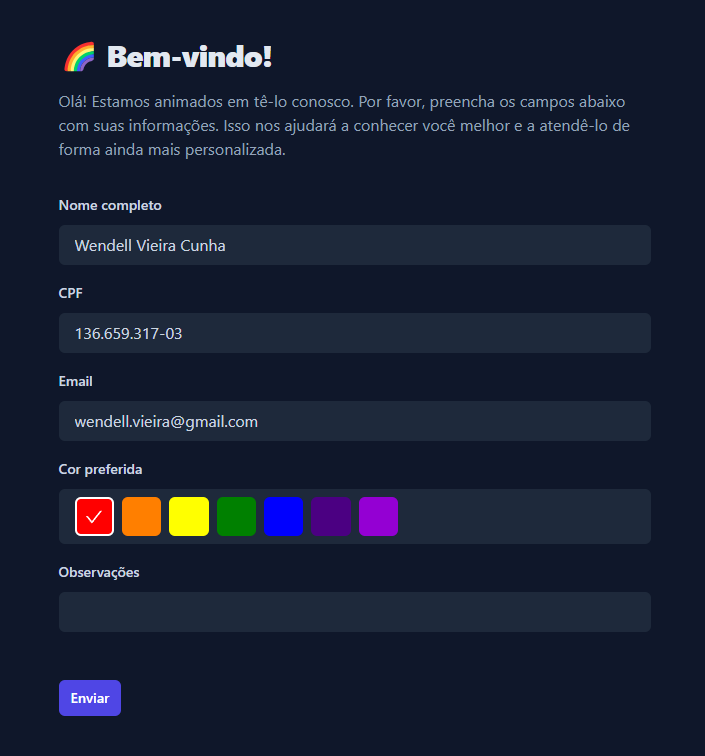
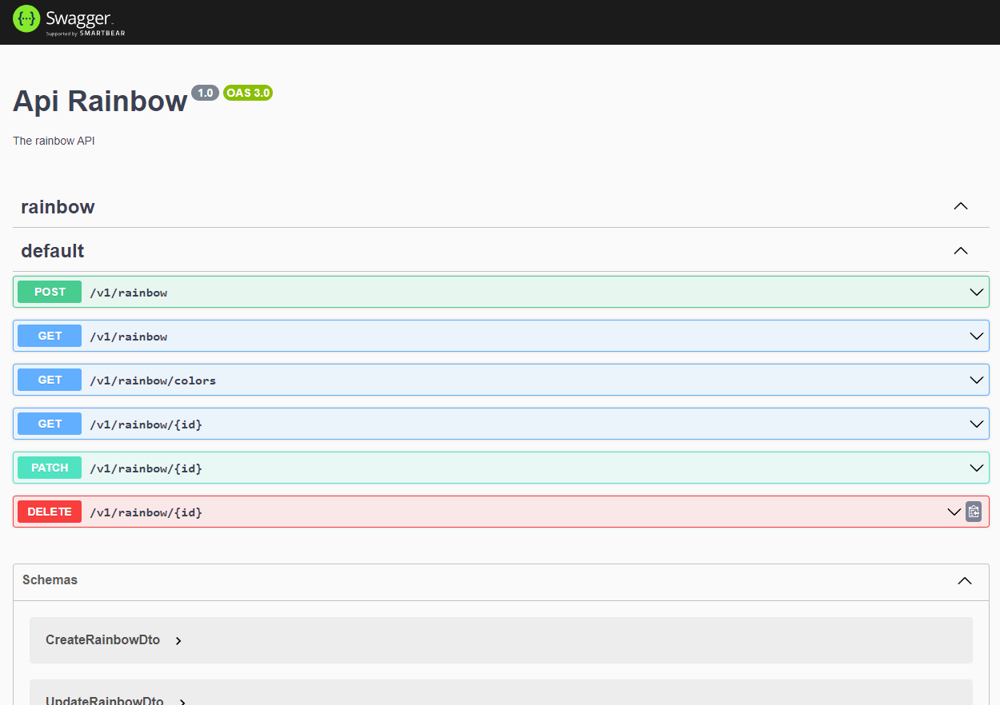

## Considerações sobre o teste

Durante a execução deste teste, busquei demonstrar o cuidado e a atenção aos detalhes que costumo aplicar em meus componentes. Infelizmente, devido a restrições de tempo, não pude implementar todas as características de qualidade que gostaria.

## Instruções para executar o projeto

### Backend:

Para iniciar o backend, use o comando:

```sh
docker-compose up backend
```

### Frontend

Antes de iniciar o frontend, assegure-se de instalar todas as dependências:

```sh
npm install
```

Agora, para iniciar o frontend, use o comando:

```sh
npm run start
```

## Sobre a entraga

Confira abaixo a tela final do teste:

<p>

</p>

Além disso, é possível acessar a documentação da API através do Swagger no seguinte endereço: [http://localhost:3030/api](http://localhost:3030/api)

<p>
 
</p>

### Coisas que ficaram faltando

Aqui estão algumas funcionalidades e características que não foram implementadas devido a restrições de tempo ou outras limitações:

#### Frontend:

- **Documentação dos Componentes**: A aplicação ainda carece de uma documentação completa dos componentes utilizando o Storybook.

- **Testes de Componentes Globais**: A cobertura de testes ainda é limitada. Os testes unitários para componentes globais utilizando Jest estão pendentes.

- **Testes de Páginas (E2E)**: Os testes end-to-end para páginas usando Selenium ainda não foram implementados.

#### Backend:

- **Tratamento das DTOs**: O tratamento das Data Transfer Objects (DTOs) com o class-validator ainda está pendente.

- **Testes dos Serviços**: Testes unitários para os serviços utilizando Jest ainda precisam ser adicionados.

- **Testes dos Controllers (E2E)**: Testes end-to-end para os controllers, utilizando supertest, ainda não foram desenvolvidos.

Estas são as melhorias pendentes que geralmente implementaria em futuras iterações do projeto.
